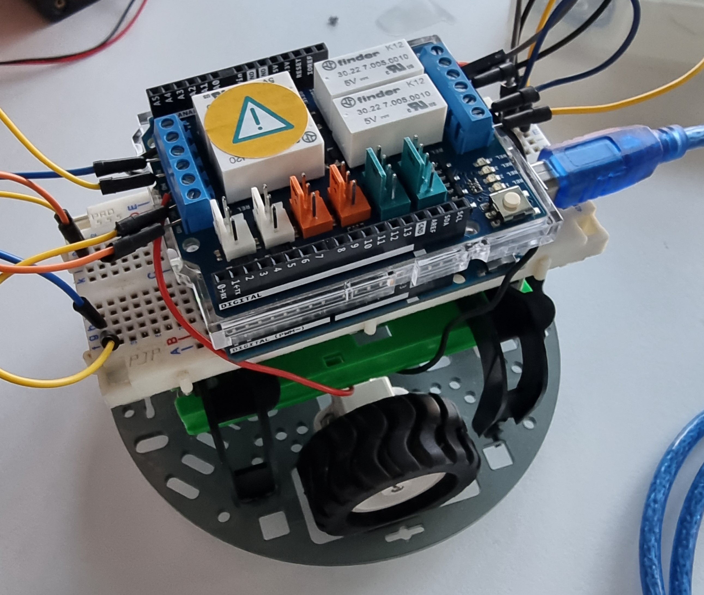

# Remote_Controlled_car

A remote controlled car with Arduino

  by .... 

 

  with Crobotic 
  

---

  

## Hardware

- ###  2 motors DC

  

- ### 4 Relays Shield 4 Relays for controlling the two motors.

  

> :bulb: For more information :  https://docs.arduino.cc/hardware/4-relays-shield?queryID=ee5e88969bf64706ee804e239370732d

- ### Ultrasonic Sensor HC-SRO4

  

> :bulb: For more information : https://www.makerguides.com/hc-sr04-arduino-tutorial/

- ### IR Receiver Module with its Remote

  

> :bulb: For more information : https://www.makerguides.com/ir-receiver-remote-arduino-tutorial/